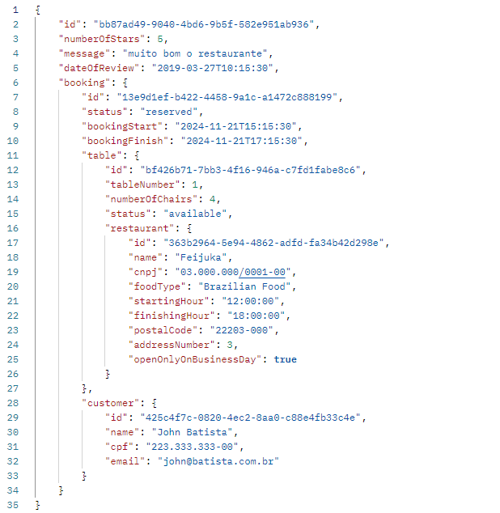

# Restaurant API

### DESCRIPTION

In this project, the restaurant owners can register your establishment with some important information, in addition the tables that que customer will register your bookings. There will be customer information to track the whole data, and in the final of booking, the customer will be able to review the meal and the restaurant. 

#### booking call example

#### Swagger UI

- Open Swagger UI at `localhost:8080/swagger-ui` after running the application.

#### Postman Collections

